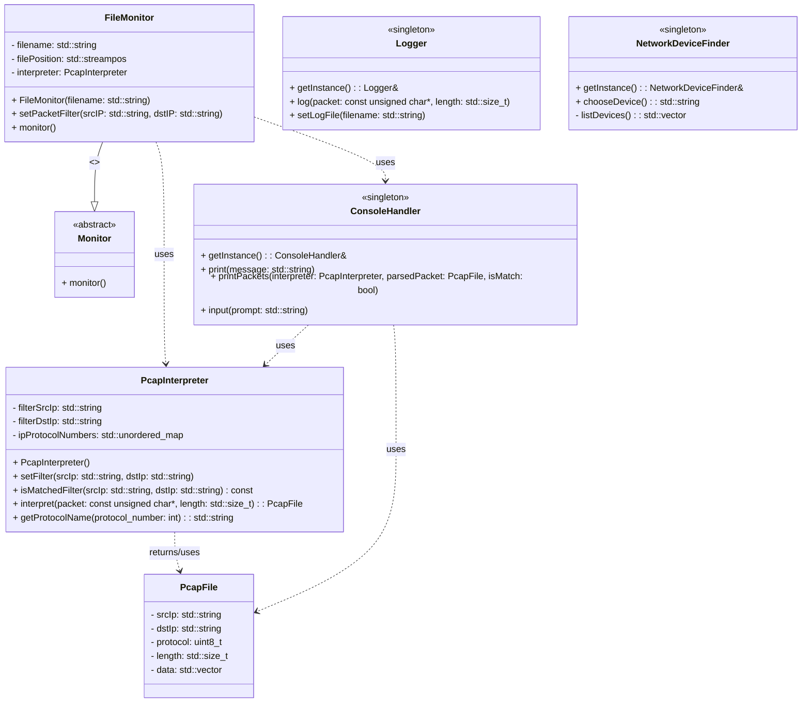

# cpp-networkanalyzer
simple tool to analyze network packages (pcap files)

Platform independent, lists your network devices to analyze network packages
Tested on ubuntu and mac os. Should work on windows but did not test on that. 

To compile

    ```bash
    make all
    ``` 
To clean
    
    ```
     make clean 
     
    ``` 

## class diagram



1. Logger
Attributes:

fileStream: std::ofstream: Used for writing logs to a file.
mtx: std::mutex: Ensures thread-safe access to the logging functionality.
Methods:

+ getInstance() : Logger&: Singleton method to get the single instance of Logger.
+ log(packet: const unsigned char*, length: std::size_t): Logs packet data.
+ setLogFile(filename: std::string): Sets the filename for logging.
Relationship:

Singleton Pattern: Ensures only one instance exists.
2. FileMonitor
Attributes:

filename: std::string: The name of the file to monitor.
filePosition: std::streampos: The current position in the file for monitoring.
interpreter: PcapInterpreter: Used to interpret packet data.
Methods:

+ FileMonitor(filename: std::string): Constructor that initializes the filename.
+ setPacketFilter(srcIP: std::string, dstIP: std::string): Sets filters for source and destination IP addresses.
+ monitor(): The method from Monitor that is overridden to implement monitoring logic.
- print(buffer: const unsigned char*, length: std::size_t): Private method to print packet data.
Relationships:

Inherits from Monitor: FileMonitor provides a concrete implementation for the monitor method defined in the abstract Monitor class.
Uses PcapInterpreter: FileMonitor relies on PcapInterpreter to interpret packet data.
Uses ConsoleHandler: FileMonitor utilizes ConsoleHandler for printing information.
3. Monitor
Methods:

+ monitor() = 0: Pure virtual method that must be implemented by derived classes.
+ ~Monitor(): Virtual destructor.
Relationships:

Abstract Class: Provides a base interface for monitoring, with the monitor method to be implemented by subclasses.
4. PcapInterpreter
Attributes:

filterSrcIp: std::string: Source IP address filter.
filterDstIp: std::string: Destination IP address filter.
ipProtocolNumbers: std::unordered_map<int, std::string>: Maps IP protocol numbers to their names.
Methods:

+ PcapInterpreter(): Constructor.
+ setFilter(srcIp: std::string, dstIp: std::string): Sets the source and destination IP filters.
+ isMatchedFilter(srcIp: std::string, dstIp: std::string) const: Checks if the given IP addresses match the filters.
+ interpret(packet: const unsigned char*, length: std::size_t) : PcapFile: Interprets a packet and returns a PcapFile structure.
+ getProtocolName(protocol_number: int): std::string: Returns the protocol name for a given protocol number.
Relationships:

Uses PcapFile: Provides functionality to interpret and return PcapFile data.
5. PcapFile
Attributes:

srcIp: std::string: Source IP address.
dstIp: std::string: Destination IP address.
protocol: uint8_t: Protocol number.
length: std::size_t: Length of the packet.
data: std::vector<unsigned char>: Raw packet data.
Relationships:

Used by PcapInterpreter: PcapInterpreter uses this structure to return interpreted packet data.
6. ConsoleHandler
Methods:

+ getInstance() : ConsoleHandler&: Singleton method to get the single instance of ConsoleHandler.
+ print(message: std::string): Prints a message to the console.
+ printPackets(interpreter: PcapInterpreter, parsedPacket: PcapFile, isMatch: bool): Formats and prints packet details.
+ input(prompt: std::string): Reads input from the console.
Relationships:

Uses PcapFile: For printing packet details.
Uses PcapInterpreter: For formatting protocol names.
7. NetworkDeviceFinder
Attributes:

listDevices() : std::vector<std::string>: Lists available network devices.
Methods:

+ getInstance() : NetworkDeviceFinder&: Singleton method to get the single instance of NetworkDeviceFinder.
+ chooseDevice() : std::string: Allows the user to choose a network device.
Relationships:

Singleton Pattern: Ensures only one instance exists.
Uses ConsoleHandler: For user interaction.
Relationships:
Inheritance:

FileMonitor → Monitor: FileMonitor inherits from Monitor, meaning FileMonitor must implement the pure virtual monitor method from Monitor.
Usage:

FileMonitor → PcapInterpreter: FileMonitor uses PcapInterpreter to interpret packet data.
FileMonitor → ConsoleHandler: FileMonitor uses ConsoleHandler to print messages and packet details.
ConsoleHandler → PcapFile: ConsoleHandler formats and prints details about packets.
ConsoleHandler → PcapInterpreter: ConsoleHandler uses PcapInterpreter to obtain protocol names.
PcapInterpreter → PcapFile: PcapInterpreter generates PcapFile instances to encapsulate packet data.
Singleton Pattern:

Logger: Ensures there is only one instance of Logger.
NetworkDeviceFinder: Ensures there is only one instance of NetworkDeviceFinder.


## what can be done to improve?
 - Implement dependency injection on FileMonitor to have the PcapInterpreter as a dependency 
   to have the flexibility of other file types
 
 - FileMonitor's sleep structure can be improved?

 - All classes can be modified according to single repsonsibility principle
    - FileMonitor now monitoring the file and printing it on the console. instead, It can be seperated

 - Dependency inverison can be achieved??
    - Instead of having filemonitor object directly in the main, we can have interface object for that

 - ConsoleHandler can be seperated to have a interface??

 - Observer pattern can be used


