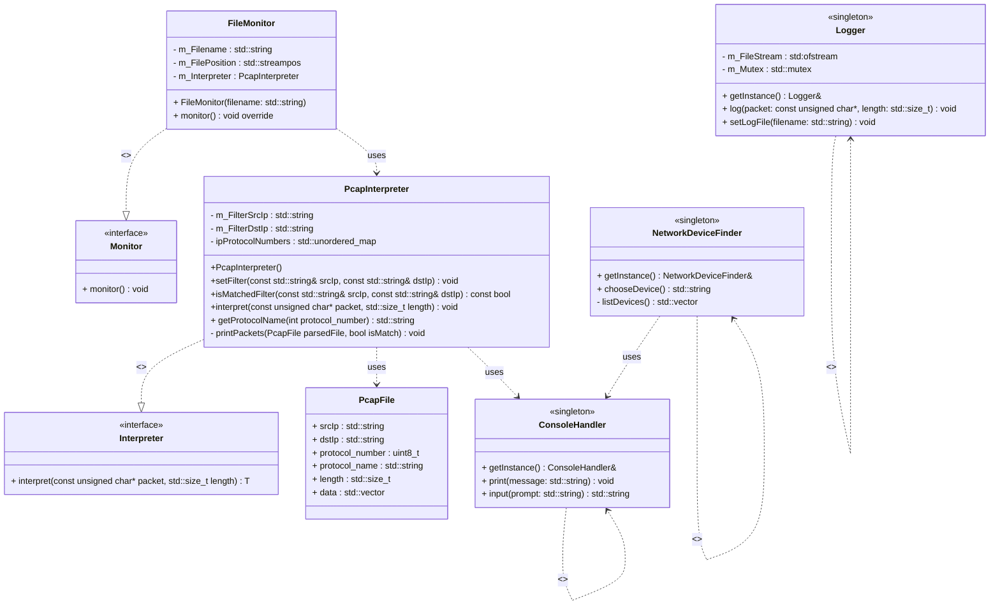

# cpp-networkanalyzer
simple tool to analyze network packages (pcap files)

Platform independent, lists your network devices to analyze network packages
Tested on ubuntu and mac os. Should work on windows but did not test on that. 

### Compile

     make all

### Run
    sudo permission is needed to be able to read the network interface

    sudo ./build/network_analyzer

# Class diagram

